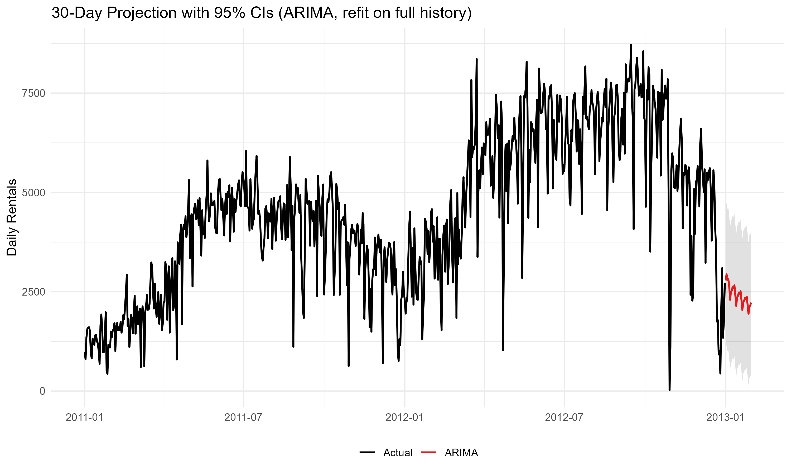

# Capital Bikeshare Demand Forecast (ARIMA & ARIMAX)

Time series forecasting of daily bike rentals for **Capital Bikeshare** (2011–2012) using R.  
Compares a baseline ARIMA model with an ARIMAX model that adds **weather data** (temperature, humidity, windspeed) to improve accuracy.

**Full write-up & plots:** `bikeshare_projection_report.html` (RMarkdown HTML report)

---

## Quick Results
- **+~10% accuracy** with ARIMAX vs ARIMA on a **holdout (H2 2012)** period (RMSE, MAPE).  
- **30-day projection beyond 2012-12-31** using ARIMA (with 95% CIs).  
  - ARIMAX needs future weather inputs; ARIMA was used for an xreg-free projection.

---

## Project Overview
**Goals**
1) Forecast short-term bikeshare demand.  
2) Quantify how much **external factors (weather)** improve forecast accuracy.

**Dataset**
- 731 daily observations from the UCI Bike Sharing Dataset (2011–2012)
- Features: total rentals (`cnt`), weather, and calendar variables

**Key Question**  
> Does including weather data make forecasts more accurate — and by how much?

---

## Methods
- **EDA & Decomposition:** Upward trend, weekly seasonality, winter dips. Stationarity checked via ACF/PACF; differencing applied.  
- **Models Compared:**  
  - **ARIMA(1,1,1)(1,0,2)[7]** — baseline (no exogenous inputs)  
  - **ARIMAX** — ARIMA with exogenous regressors: `temp_c`, `hum`, `windspeed`  
- **Implementation:** `modeltime` + `parsnip` (`auto_arima()` for selection); ARIMAX uses `xregs`.

---

## Results

### Out-of-Sample Comparison (H2 2012 Holdout)
ARIMAX tracks unseen data more closely than ARIMA and reduces error.


- **Fit quality (in-sample AIC/σ², for reference):**  
  - ARIMA — AIC: 12,041.75; σ²: 844k  
  - ARIMAX — AIC: 11,791.54; σ²: 598k

**Coefficient intuition:** Warmer days mean an increase in rentals; higher humidity/wind mean fewer rentals.

### 30-Day Projection (Beyond 2012-12-31)
Refit **ARIMA** on full history and project 30 days with **95% confidence intervals**.



> **Why ARIMA for the future?**  
> ARIMAX requires future values of exogenous variables (weather). Without a weather forecast, an ARIMAX projection would be ill-posed. ARIMA gives a defensible baseline projection that preserves trend and weekly seasonality.

---

## Repository Structure
```
/data
bikeshare_projection.Rmd              # full analysis
bikeshare_projection_report.html      # rendered report
holdout_arima_vs_arimax.png           # holdout comparison
future_30d_projection.png             # 30-day projection
```

---

## Reproduce Locally
```r
install.packages(c("tidyverse","timetk","modeltime",
                   "forecast","parsnip","lubridate","rsample"))
```
1. Open the project in R/RStudio.  
2. Knit `bikeshare_projection.Rmd` to generate `bikeshare_projection_report.html`.  
3. Plots are saved to the repo root as PNGs during knitting.

> To generate an ARIMAX future forecast, pass future `temp_c`, `hum`, and `windspeed` as `xregs` (e.g., from a weather API or scenario table).

---

## Takeaways
- Weather explains a meaningful share of day-to-day demand variability.  
- ARIMAX improves accuracy on unseen data; use it when **future exogenous inputs** are available.  
- Even modest error reductions can materially improve rebalancing, staffing, and maintenance planning.

---

**Author:** Daniel Wilkinson
