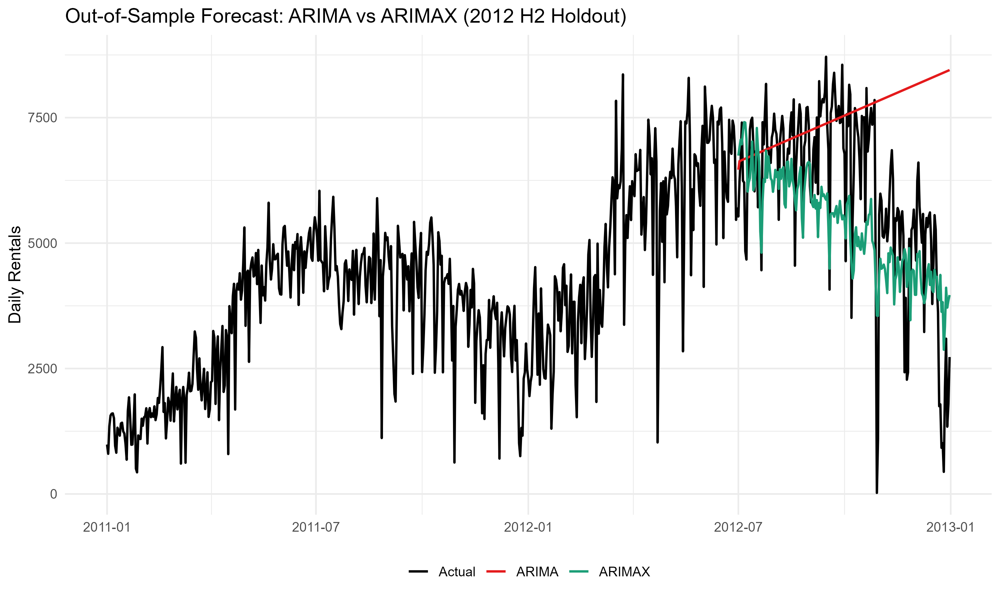

# Capital Bikeshare Demand Forecast (ARIMA & ARIMAX)

Time series forecasting of daily bike rentals for **Capital Bikeshare** (2011–2012) using R.  
Compares a baseline ARIMA model with an ARIMAX model that adds **weather data** (temperature, humidity, windspeed) to improve accuracy.

 **Full write-up & plots:** `bikeshare_projection_report.html` (RMarkdown HTML report)

---

## Project Overview
**Goal:**  
1. Forecast short-term demand for bike sharing.  
2. Quantify how much external factors (weather) improve forecast accuracy.

**Dataset:**  
- 731 daily observations from UCI Bike Sharing Dataset.  
- Features include total rentals (`cnt`), weather, and calendar variables.

**Key Question:**  
> Does including weather data make forecasts more accurate — and by how much?

---

## Methods
- **Exploratory Analysis & Decomposition:**  
  - Clear weekly seasonality and yearly winter dips.  
  - Upward demand trend over the period.  
  - Stationarity checks with ACF/PACF; differencing applied.
- **Models Compared:**  
  - **ARIMA(1,1,1)(1,0,2)[7]** — baseline using only past demand.  
  - **ARIMAX** — ARIMA with exogenous regressors (`temp_c`, `hum`, `windspeed`).
- **Implementation:**  
  - Built in R with `modeltime`, `parsnip`, and `auto_arima()` for parameter selection.  
  - ARIMAX trained with `xregs` for weather covariates.

---

## Results
**Model performance:**
- **Accuracy improvement:** ARIMAX reduced RMSE and MAPE by ~10% vs ARIMA.
- **Fit quality:**
  - ARIMA — AIC: 12,041.75, σ²: 844k  
  - ARIMAX — AIC: 11,791.54, σ²: 598k

**Interpretation:**  
- Warmer days → higher rentals  
- Higher humidity/wind → lower rentals  
- ARIMAX tracked short-term fluctuations better than ARIMA.



---

## Repository Structure
```
*.csv      - Raw CSV data
bikeshare_projection.Rmd   - Full analysis in RMarkdown
bikeshare_projection_report.html - Rendered HTML report
holdout_arima_vs_arimax.png - Key comparison plot
```

---

## How to Reproduce
```r
install.packages(c("tidyverse","timetk","modeltime",
                   "forecast","parsnip","lubridate"))
```
1. Clone the repo and open in RStudio.  
2. Knit the RMarkdown file to generate the HTML report.  
3. Explore interactive plots and model diagnostics in the HTML output.

---

## Takeaways
- Weather explains a meaningful share of demand variability in bike share usage.  
- The same ARIMAX approach can be adapted to:
  - Retail sales with promotions/holidays
  - Energy demand with temperature data
  - Web traffic with marketing events
- Even modest forecast accuracy gains can improve operations, reduce waste, and optimise resource planning.

---

**Author:** Daniel Wilkinson
