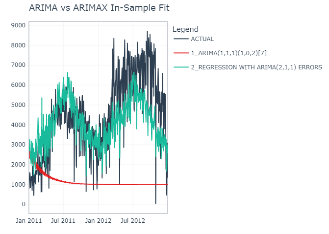

# Capital Bikeshare Demand Forecast (ARIMA & ARIMAX)

Forecast daily bike rentals for Capital Bikeshare using classic ARIMA and ARIMAX (ARIMA with exogenous regressors) in R. The analysis explores trend/seasonality, compares model families, and produces interpretable forecasts.

> Full write-up & plots: `bikeshare_projection_report.html` (RMarkdown HTML report).

---

## Project Overview
- **Objective:** short-term forecasting of total daily rentals (`cnt`) and understanding drivers.  
- **Data:** 731 daily observations (2011–2012) with weather & calendar features.  
- **Why ARIMAX?** Weather affects cycling. Adding **temperature, humidity, windspeed** as exogenous regressors improves fit over pure ARIMA.

---

## Methods
- **EDA & Decomposition:** Trend up; weekly seasonality; winter dips. Stationarity checks via ACF/PACF and differencing.  
- **Models compared:**
  - **ARIMA(1,1,1)(1,0,2)[7]** baseline (no exogenous inputs).
  - **ARIMAX** with `temp_c`, `hum`, `windspeed` (regression with ARIMA(2,1,1) errors).  
- **Implementation:** `modeltime` + `parsnip` with `auto_arima()`; ARIMAX uses `xregs`. (See report code blocks.)

---

## Results (ARIMA vs ARIMAX)
- **Fit quality:** ARIMAX outperforms ARIMA (lower AIC; lower residual variance).  
  - ARIMA AIC ≈ **12,041.75**; σ² ≈ **844k**.  
  - ARIMAX AIC ≈ **11,791.54**; σ² ≈ **598k**.
 


- **Coefficient intuition:** Warmer temps increase rentals; higher humidity/wind reduce rentals (significant effects reported in the write-up).


---

## Data
- **Source:** UCI Bike Sharing Dataset (Capital Bikeshare) with weather + calendar features.  
- **Key fields:** `cnt`, `casual`, `registered`, `temp` (scaled; `temp_c = temp*41`), `hum`, `windspeed`, `season`, `mnth`, `weekday`, `holiday`, `workingday`, `weathersit`.

---

## How to Run
1. Clone the repo and open in R/RStudio.
2. Install packages:
   ```r
   install.packages(c("tidyverse","timetk","modeltime","forecast","parsnip","lubridate"))
   ```
3. Knit the RMarkdown or run scripts to reproduce EDA, model training, and forecasts.
4. Open `bikeshare_projection_report.html` for interactive plots and model diagnostics.

---

## Repo Structure
- `.csv` – raw data
- `.Rmd` – scripts and the main RMarkdown analysis
- `bikeshare_projection_report.html` – rendered report (ARIMA vs ARIMAX, plots, diagnostics).

---

## Findings
- Demand is strongly seasonal (weekly + annual), with a clear upward trend over 2011–2012.  
- ARIMAX with weather covariates captures variability better than ARIMA alone and is preferred for forecasting.

---


## Author
Daniel Wilkinson
